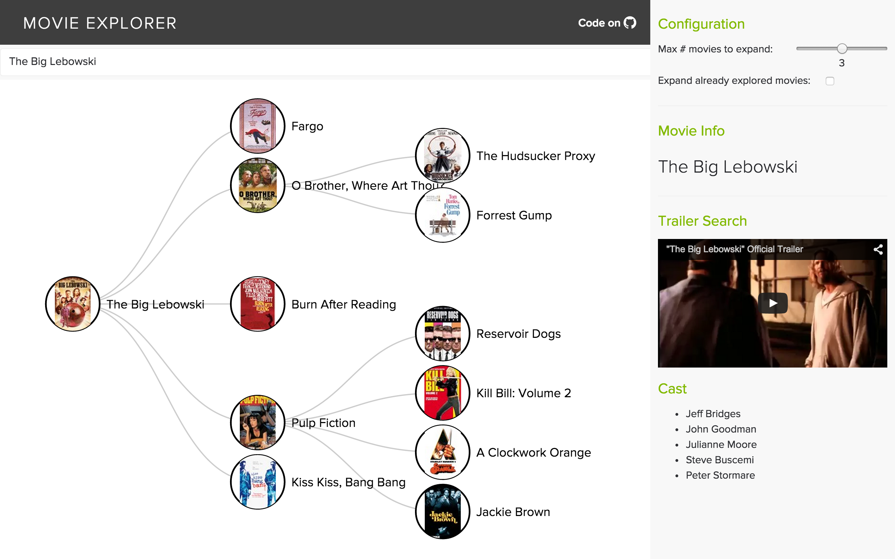

Movie Explorer
===============

This project is a fork of Spotify's awesome [Artist Explorer](https://artistexplorer.spotify.com/)
and pulls movie-similarity information from the [Rotten Tomatoes API](http://developer.rottentomatoes.com/).

[Movie Explorer](https://movieexplorer.me/) helps movie enthusiasts spatially explore movie relationships and discover new movies. Start from any movie, navigate through trees of related movies, watch trailers, and read movie metadata as you go.



Running Locally
===============
You will need to create a `keys.py` file at the project root with the following keys and format:

```
RT_KEY='t1s-aRandomK3y-th0'
GOOGLE_YOUTUBE_API_KEY='you7ube-K3Y5'
```

Obviously those aren't real keys so don't waste time trying them :) you will need your own Rotten Tomatoes and YouTube API keys.

**Not necessary but strongly suggested:** Create a Python [virtualenv](http://docs.python-guide.org/en/latest/dev/virtualenvs/) or use an existing one before installing the dependencies of this project.

Rotten Tomatoes API calls are proxied through a flask server. Start this server first.

```
virtualenv venv
source /venv/bin/activate
cd server
pip install -r requirements.txt
python server.py
```

And you also need to serve static assets which is done from the root of the project. I recommend just using Python's SimpleHTTPServer module. To do that, change directory to the project root and run the following:

```
python -m SimpleHTTPServer
```

Consumed Libraries:
--------------
* [Rotten Tomatoes API](http://developer.rottentomatoes.com/)
* [d3](http://d3js.org/)
* [Google's YouTube API](https://developers.google.com/youtube/)
* [geoplugin](http://www.geoplugin.com/)
* [freegeoip](https://freegeoip.net)

